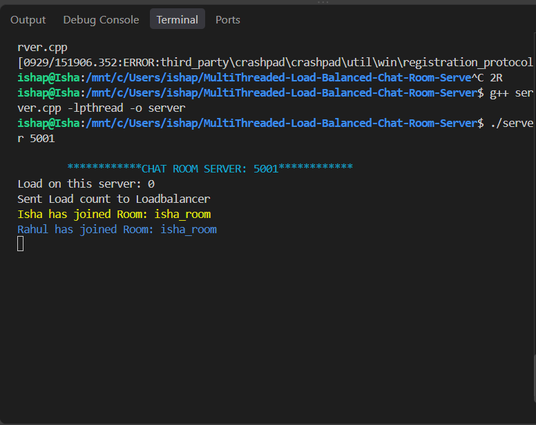
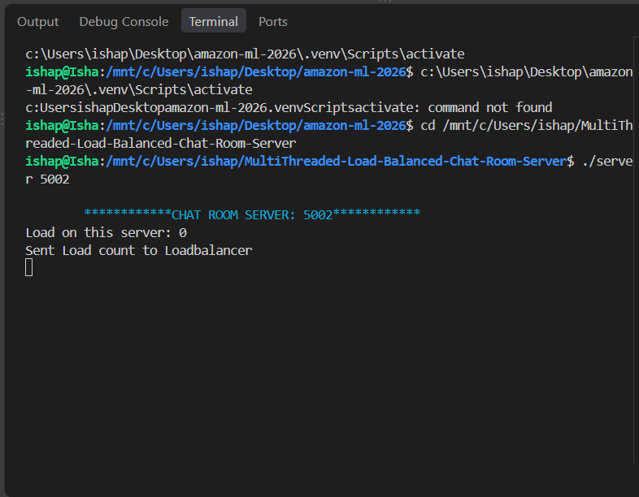
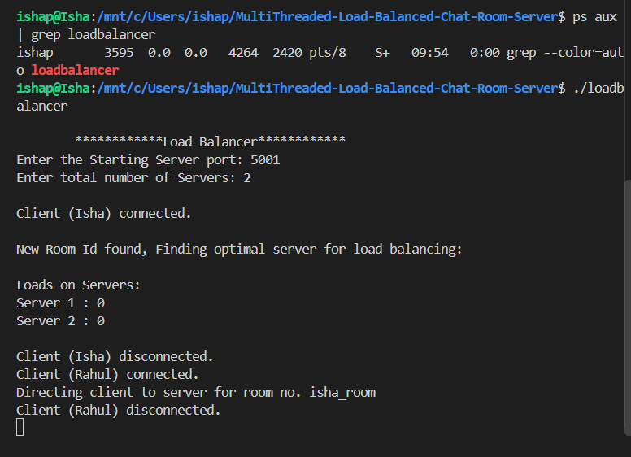
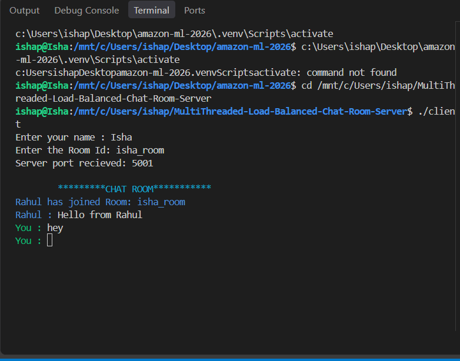
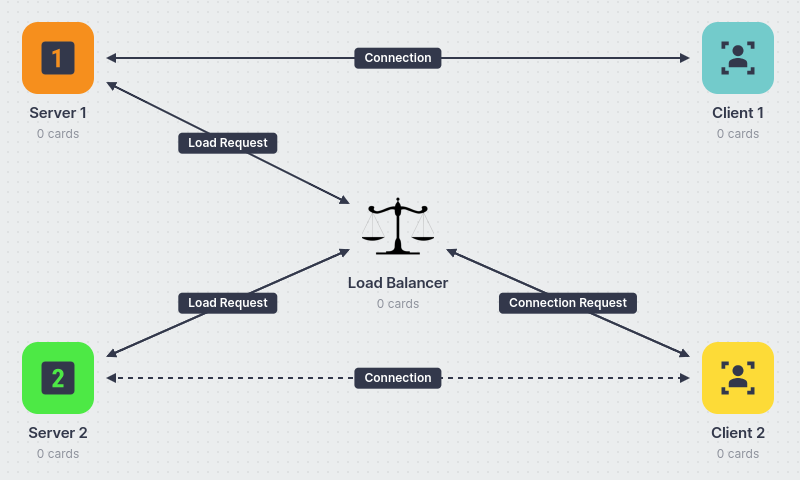

# 🚀 Multi-Threaded Load-Balanced Chat Room Server

A **C++ based multi-threaded chat application** that supports multiple clients, multiple chat rooms, and multiple backend servers through a centralized **Load Balancer**.

The project demonstrates practical concepts of **TCP socket programming, client-server architecture, multithreading, synchronization, concurrent communication, and dynamic load balancing** in a Linux/Unix environment.

---

## ✨ Features

* 🔌 TCP-based client-server communication
* 👥 Multiple simultaneous clients
* 💬 Multiple chat rooms
* 🧵 Multi-threaded client handling
* ⚖️ Dynamic load balancing
* 🖥️ Multiple backend chat servers
* 🔐 Mutex-based synchronization
* 📊 Server load monitoring
* 📡 Real-time message broadcasting
* 🐧 Linux/Unix socket programming
* 🚀 C++ implementation using POSIX sockets

---

## 🏗️ System Architecture

```text
                         ┌──────────────────────┐
                         │    Load Balancer     │
                         │      Port 6000       │
                         └──────────┬───────────┘
                                    │
                     ┌──────────────┴──────────────┐
                     │                             │
              ┌──────▼──────┐               ┌──────▼──────┐
              │   Server 1  │               │   Server 2  │
              │    :5001    │               │    :5002    │
              └──────┬──────┘               └──────┬──────┘
                     │                             │
                     └──────────────┬──────────────┘
                                    │
                          ┌─────────▼─────────┐
                          │      Clients      │
                          │                   │
                          │  Isha / Rahul / N │
                          └───────────────────┘
```

---

## 🔄 How It Works

### 1. Client Connects to the Load Balancer

A client first connects to the Load Balancer and provides:

* Client name
* Room ID

```text
Enter your name : Isha
Enter the Room Id: isha_room
```

### 2. Load Balancer Checks Server Load

The Load Balancer communicates with the available servers and requests their current client load.

```text
Loads on Servers:

Server 1 : 0
Server 2 : 0
```

### 3. Server Selection

The Load Balancer compares the available server loads and selects an appropriate backend server.

The selected server port is returned to the client:

```text
Server port received: 5001
```

### 4. Client Connects to the Selected Server

The client then establishes a TCP connection with the selected server.

### 5. Multi-Threaded Communication

The server creates a dedicated thread for handling each connected client.

This allows multiple clients to communicate concurrently without blocking one another.

### 6. Room-Based Communication

Clients using the same Room ID can communicate with each other.

Example:

```text
Room: isha_room

Rahul : Hello from Rahul
Isha  : hey
```

---

## 🧰 Technology Stack

| Technology        | Purpose                                       |
| ----------------- | --------------------------------------------- |
| **C++**           | Core implementation                           |
| **TCP/IP**        | Reliable network communication                |
| **POSIX Sockets** | Client-server networking                      |
| **C++ Threads**   | Concurrent client handling                    |
| **Mutex**         | Synchronization and race-condition prevention |
| **Linux / WSL**   | Development and execution environment         |
| **g++**           | Compilation                                   |

---

## 📁 Project Structure

```text
MultiThreaded-Load-Balanced-Chat-Room-Server/
│
├── client.cpp
├── server.cpp
├── loadbalancer.cpp
├── README.md
│
├── client
├── server
├── loadbalancer
│
└── img/
    ├── server1.png
    ├── server2.png
    ├── loadbalancer.png
    ├── chat.png
    └── ConnectionDiagram.png
```

---

## 🧩 Core Components

### `server.cpp`

The server is responsible for:

* Creating and binding a TCP socket
* Accepting incoming client connections
* Maintaining connected-client information
* Creating a thread for each client
* Managing chat rooms
* Broadcasting messages
* Synchronizing access to shared client data
* Handling client disconnections

### `client.cpp`

The client is responsible for:

* Connecting to the Load Balancer
* Sending client information
* Sending the requested Room ID
* Receiving the selected server port
* Connecting to the selected chat server
* Sending chat messages
* Receiving messages from other clients

### `loadbalancer.cpp`

The Load Balancer is responsible for:

* Listening for incoming client requests
* Maintaining a list of available servers
* Requesting current server loads
* Comparing server loads
* Selecting an appropriate server
* Redirecting clients to the selected server

---

## 🌐 Network Configuration

The default local configuration used for testing is:

| Component     |   Port |
| ------------- | -----: |
| Load Balancer | `6000` |
| Server 1      | `5001` |
| Server 2      | `5002` |

Additional servers can be configured using consecutive ports.

---

## ⚙️ Installation & Setup

### Prerequisites

* Linux / WSL
* GNU C++ compiler
* POSIX socket support
* pthread support

### Clone the Repository

```bash
git clone <repository-url>
cd MultiThreaded-Load-Balanced-Chat-Room-Server
```

### Compile the Server

```bash
g++ server.cpp -lpthread -o server
```

### Compile the Load Balancer

```bash
g++ loadbalancer.cpp -lpthread -o loadbalancer
```

### Compile the Client

```bash
g++ client.cpp -lpthread -o client
```

---

## ▶️ Running the Application

### Step 1 — Start Server 1

Open a terminal:

```bash
./server 5001
```

Expected output:

```text
************CHAT ROOM SERVER: 5001************
```

### Step 2 — Start Server 2

Open another terminal:

```bash
./server 5002
```

Expected output:

```text
************CHAT ROOM SERVER: 5002************
```

### Step 3 — Start the Load Balancer

Open another terminal:

```bash
./loadbalancer
```

Enter:

```text
Enter the Starting Server port: 5001
Enter total number of Servers: 2
```

The Load Balancer listens on port `6000`.

### Step 4 — Start a Client

Open another terminal:

```bash
./client
```

Enter the client name and Room ID when prompted.

For example:

```text
Enter your name : Isha
Enter the Room Id: isha_room
```

### Step 5 — Start Additional Clients

Open another terminal and run:

```bash
./client
```

For example:

```text
Enter your name : Rahul
Enter the Room Id: isha_room
```

Clients using the same Room ID can communicate with each other.

---

## 🧪 Testing

The application was tested locally using:

```text
Server 1       → 5001
Server 2       → 5002
Load Balancer  → 6000

Client 1       → Isha
Client 2       → Rahul

Room ID        → isha_room
```

### Server 1



### Server 2



### Load Balancer



### Multi-Client Chat



---

## 💬 Two-Way Communication Demo

The system successfully supports real-time two-way communication between clients.

Example:

```text
************CHAT ROOM************

Rahul : Hello from Rahul
Isha  : hey
```

This demonstrates that messages sent by one client are received by another client connected to the same chat room.

---

## 🔒 Concurrency & Synchronization

Multiple clients can connect to the same server concurrently.

The server maintains shared client information using a `vector<Client>` and protects critical sections using mutex synchronization.

Mutexes help prevent race conditions when multiple threads access or modify shared client information.

Synchronization is particularly important during:

* Client connection
* Client disconnection
* Room assignment
* Client information updates
* Message broadcasting
* Removal of disconnected clients

---

## ⚖️ Load Balancing

The Load Balancer separates incoming connection handling from the actual chat servers.

The process is:

```text
Client
   │
   ▼
Load Balancer
   │
   ├── Check Server 1 Load
   │
   ├── Check Server 2 Load
   │
   ▼
Select Appropriate Server
   │
   ▼
Client Connects to Selected Server
   │
   ▼
Chat Communication
```

This allows client connections to be distributed across multiple backend servers instead of relying on a single server.

---

## 🐛 Debugging & Reliability

During local testing, a runtime issue was identified when disconnected clients were removed from the shared `vector<Client>`.

The problematic sequence attempted to access the vector element after it had already been erased.

The operation was corrected by closing the client's socket before removing the client from the vector:

```cpp
close(clients[i].client_socket);
clients.erase(clients.begin() + i);
```

This prevented invalid vector access and allowed the server to continue handling subsequent client connections.

---

## 🧠 Key C++ & Systems Concepts

This project provides hands-on exposure to:

* C++ programming
* Object-oriented and structured programming
* TCP/IP networking
* Socket programming
* POSIX APIs
* Client-server architecture
* Multi-threading
* Thread lifecycle management
* Mutex synchronization
* Race-condition prevention
* Shared data structures
* Concurrent communication
* Load balancing
* Linux command-line development
* Network error handling
* Runtime debugging

---

## 📚 Learning Outcomes

Through this project, I developed practical understanding of:

1. How TCP client-server communication works.
2. How sockets are created and used for network communication.
3. How multiple clients can be handled concurrently using threads.
4. Why synchronization is required when multiple threads access shared data.
5. How a Load Balancer can distribute incoming connections across servers.
6. How multiple chat rooms can be implemented using Room IDs.
7. How to debug runtime issues involving concurrent data structures.
8. How to build and run POSIX socket applications in a Linux environment.

---

## 🚀 Future Improvements

Possible future enhancements include:

* 🔐 TLS/SSL encrypted communication
* 👤 User authentication
* 💾 Persistent chat history
* 💬 Private messaging
* ❤️ Server health monitoring
* 🔄 Automatic server failover
* 📊 More advanced load-balancing strategies
* 🐳 Docker-based deployment
* 🧪 Automated unit and integration testing
* 🛑 Graceful server shutdown
* 🔁 Automatic client reconnection
* 📈 Server performance monitoring

---

## 📸 Connection Diagram



---

## 🎯 Project Highlights

```text
✓ Multi-threaded C++ server
✓ TCP socket communication
✓ Multiple concurrent clients
✓ Multiple chat rooms
✓ Multiple backend servers
✓ Dynamic load balancing
✓ Mutex-based synchronization
✓ Linux/WSL execution
✓ Runtime debugging and reliability improvements
```

---

## 📌 References

* TCP/IP Socket Programming
* POSIX Socket APIs
* C++ Multithreading
* C++ Mutex Synchronization
* Load Balancing Concepts
* Linux Network Programming

---

## ⭐ Project Summary

**Multi-Threaded Load-Balanced Chat Room Server** is a systems-oriented C++ project demonstrating how multiple clients can communicate in real time through TCP sockets while multiple backend servers handle connections through a centralized Load Balancer.

The project combines **network programming, concurrency, synchronization, and load distribution** into a practical client-server application.
